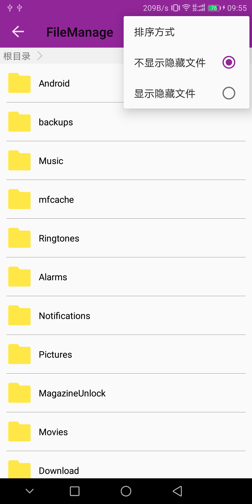
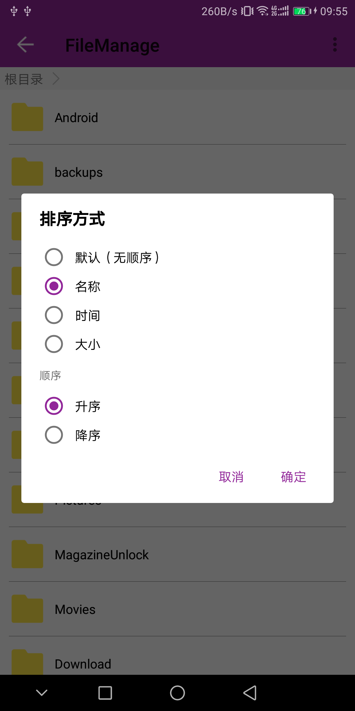
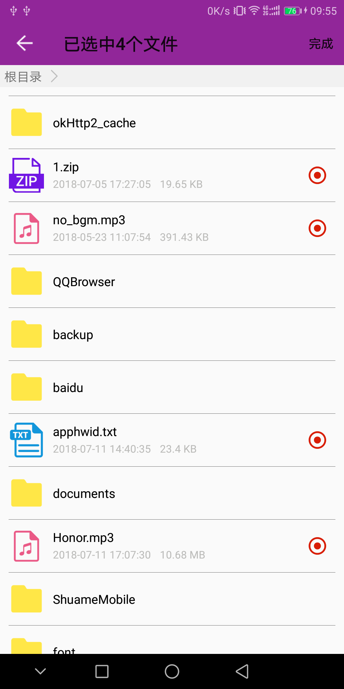

采用Kotlin编码(兼容Java) [详情点我](https://blog.csdn.net/qq_28322987/article/details/81384886)

<br>**↓↓↓ 鸣谢↓↓↓**<br>
[SwipeMenuView](https://github.com/jdsjlzx/LRecyclerView)

## 特点

1. 支持操作音频，视频，图片，txt，zip，word，excel，ppt，pdf等文件
2. 支持查看指定文件类型
3. 支持音频，视频播放，图片查看，zip解压
4. 支持多选，最大数量限制
5. 支持实时排序、指定文件路径访问

## 使用

Step 0. 申明权限
```xml

<uses-permission android:name="android.permission.WRITE_EXTERNAL_STORAGE" />
<uses-permission android:name="android.permission.READ_EXTERNAL_STORAGE" />


```

Step 1. 可在Application中或调用前初始化  请根据需要自行添加，初始均为为默认值

```Kotlin

FileManageHelp.getInstance()
                .setFileTypeListener(FileTypeListener()) // 获取文件类型
                .setImgeLoad(MyFileImageListener()) // 图片加载方式（自己实现）
                .setJumpListener(JumpByTypeListener()) // 跳转方式
                .setFileInfoListener(FileInfoListener()) // 文件详情 
                .setMaxLength(9, "最大选取数量：9") // 设置最大可选取数量、超过最大数量的提示语句
                .setCanRightTouch(true) // 滑动删除 
                .setShowHiddenFile(false) // 是否显示隐藏文件 
                .setFileFilterArray(arrayOf(PNG, JPG, GIF, MP3, AAC, MP4, _3GP, TXT, ZIP)) // 设置过滤规则
                .setSortordByWhat(FileManageHelp.BY_DEFAULT) // 设置排序方式
                .setSortord(FileManageHelp.ASC) // 升序或降序
                .isShowLog = true // 是否显示日志


```

Step 2. 在Activity或Fragment中

```kotlin

// 申明数据接收
FileManageHelp.getInstance().fileResultListener = { 
    Log.e("选中的文件size：${it.size}")
}

// 打开文件管理
FileManageHelp.getInstance().start(this)
FileManageHelp.getInstance().start(this,"指定目录")
```

```java

（Java方式）

// 申明数据接收
FileManageHelp.getInstance().setFileResultListener(new Function1<ArrayList<FileBean>, Unit>() {
            @Override
            public Unit invoke(ArrayList<FileBean> fileBeans) {
                Log.e("fileList", "size--->>>" + fileBeans.size());
                return null;
            }
        });

// 打开文件管理
FileManageHelp.getInstance().start(this);
FileManageHelp.getInstance().start(this,"指定目录")

```

至此，搞定！

> ##### 如上述类型不能满足项目需求，可对文件类型进行扩展

## 文件类型扩展 
> ###### 下面 ":" 为继承
Step 1. 新建一个类：FileType，重写里面的openFile()、loadingFile()方法 

```kotlin

// 自定义的类型
const val CUSTOM1 = "ttf"
const val CUSTOM2 = "apk"

/**
 * 自定义文件类型
 */
class CustomType : FileType {
    /**
     * 打开文件
     * @param filePath  文件路径
     * @param view      当前视图，配合跳转动画使用
     * @param context   Context
     */
    override fun openFile(filePath: String, view: View, context: Context) {
        (FileManageHelp.getInstance().getJumpListener() as MyJumpListener).jumpCustom(filePath, view, context)
    }

    /**
     * 加载文件
     * @param filePath 文件路径
     * @param pic      文件展示的图片
     */
    override fun loadingFile(filePath: String, pic: ImageView) {
        pic.setImageResource(R.mipmap.ic_launcher_round)
    }

}

```

Step 2. 新建一个类：FileTypeListener，重写里面的getFileType()方法 （有多个自定义类型，公用即可）
```kotlin

class MyFileTypeListener : FileTypeListener() {

    /**
    * 小弟不才，只能通过后缀判断文件类型，如果哪位大佬知道更好的判断方式，请告诉我
    */
    override fun getFileType(filePath: String): FileType {
        val typeStr = filePath.run {
            substring(lastIndexOf(".") + 1, length)
        }
        return when (typeStr) {
            CUSTOM1, CUSTOM2 -> CustomType()
            else -> super.getFileType(filePath)
        }
    }

}

```
Step 3. 新建一个类 : JumpByTypeListener，自己新建jumpXXX()方法（有多个自定义类型，公用即可）

```kotlin
class MyJumpListener : JumpByTypeListener() {

    override fun jumpOther(filePath: String, view: View, context: Context) {
        if (filePath.lastIndexOf(".") > 0) {
            context.toast("暂不支持【${filePath.run {
                substring(lastIndexOf(".") + 1, length)
            }}】类型的文件预览")
        } else {
            super.jumpOther(filePath, view, context)
        }
    }

    /**
     * 自定义跳转
     */
    fun jumpCustom(filePath: String, view: View, context: Context) {
        context.toast("这个是我自定义的文件类型，跳转 Custom")
    }
}

```

Step 4. 在Application中或调用前赋值  

```kotlin
FileManageHelp.getInstance()
                .setFileTypeListener(MyFileTypeListener())
                .setJumpListener(MyJumpListener())

```

> ##### 如果还是不能满足需求，源码给你，改改即可 ^_^

## 部分截图
<div align="center">



</div>

<div align="center">


</div>


 
